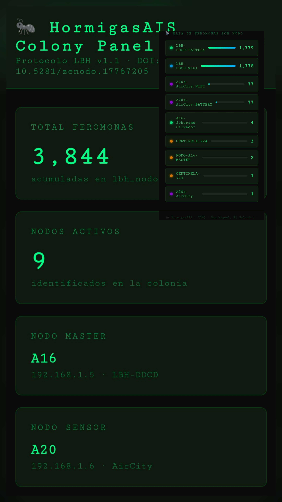

[](https://github.com/HormigasAIS/lbh-node-service)
[](https://doi.org/10.5281/zenodo.17767205)
[](https://github.com/HormigasAIS/lbh-node-service)

# 🐜 HormigasAIS — LBH Protocol Node Service

> Red distribuida soberana construida desde Android/Termux en El Salvador  
> Protocolo LBH v1.1 · DOI: [10.5281/zenodo.17767205](https://doi.org/10.5281/zenodo.17767205)

## Colony Panel



- 6,049 feromonas acumuladas
- 9 nodos activos
- A16 master + A20 sensor
- Tiempo real cada 3s


---

## ¿Qué es HormigasAIS?

HormigasAIS es una red distribuida soberana basada en el **Protocolo LBH (Lenguaje Binario HormigasAIS)** — un protocolo de comunicación binario diseñado para redes mesh con recursos limitados.

Construido completamente desde un dispositivo Android con Termux, sin servidores en la nube, sin infraestructura externa.

---

## 🌐 Estado actual de la colonia (22 Mar 2026)
TOTAL FEROMONAS:  3,720+   acumuladas en lbh_nodo.db
NODOS ACTIVOS:    9         identificados en la colonia
NODO MASTER:      A16       192.168.1.5 · LBH-DDCD
NODO SENSOR:      A20       192.168.1.6 · AirCity
### Mapa de feromonas por nodo
● LBH-DDCD:BATTERY        ████████████████  1,779
● LBH-DDCD:WIFI           ████████████████  1,778
● A20s-AirCity:WIFI       █░░░░░░░░░░░░░░░     77
● A20s-AirCity:BATTERY    █░░░░░░░░░░░░░░░     77
● A16-Soberano-Salvador   ░░░░░░░░░░░░░░░░      4
● CENTINELA_V24           ░░░░░░░░░░░░░░░░      3
● NODO-A16-MASTER         ░░░░░░░░░░░░░░░░      2
● CENTINELA-V24           ░░░░░░░░░░░░░░░░      1
● A20s-AirCity            ░░░░░░░░░░░░░░░░      1
---

## 🏗️ Arquitectura
Interfaces externas
┌──────────┬──────────┬──────────┬──────────┐
│  Slack   │  REST    │  gRPC    │  CLI     │
│ :5000    │ :8100    │ :7100    │ panel.py │
└──────────┴──────────┴──────────┴──────────┘
↓
/v1/lbh/validate
↓
┌─────── VALIDACIÓN ─────────┐
│ HMAC │ TTL │ ACL │ tipo   │
└────────────────────────────┘
↓
DHT Kademlia
↓
Gossip v2
↓
┌────────────────────────────────┐
│        COLONIA SOBERANA        │
│   A16 (master) ←→ A20 (sensor) │
│   lbh_nodo.db · SQLite         │
└────────────────────────────────┘
---

## 🚀 Stack técnico

| Componente | Tecnología |
|---|---|
| API REST | Go + Gin `:8100` |
| gRPC | Go + Protobuf `:7100` |
| Bridge TCP | Go `:9001` |
| Discovery | Python UDP `:9199` |
| DHT | Python Kademlia `:9300-9302` |
| Gossip | Python UDP `:9197` |
| Slack Bot | Python `:5000` |
| Colony Panel | Python HTTP `:8300` |
| Storage | SQLite via GORM |
| Identidad | Ed25519 + HMAC-SHA256 |
| Platform | Android/Termux ARM64 |

---

## 📡 Protocolo LBH v1.1

Formato binario de 16 bytes — 89.3% de reducción de bandwidth:
[event_type][order_id Snowflake][status][timestamp][CRC-16]
1 byte       8 bytes         1 byte   4 bytes   2 bytes
Feromona LBH sobre HTTP:
LBH://SIGNAL
version: 1.1
node: hormiga_slack
action: validacion_requerida
asset: {url}
estado: FEROMONA_PENDIENTE
hash: 74c5e3d488b8e4ab...
sig: a0de35f34a81fdf5
issued_by: CLHQ
---

## 🔐 Seguridad `/v1/lbh/validate`
POST /v1/lbh/validate
├── HMAC-SHA256 por feromona
├── TTL validado (10s – 3600s)
├── Rate limiting (10 req/60s por nodo)
├── ACL origen (nodos bloqueados)
└── Clasificación: SENSOR│DRONE│CONTRACT│INTERNAL│IMAGE
---

## 🐜 Arquitectura de contratos (XOXO)
XOXO (fiscalizador)
↓ evalúa + crea contrato
Hormiga_10 Soberana
↓ traduce a LBH + valida
Stanford
↓ firma CLHQ
Hormigas estudiantes
↓ aceptan feromonas externas
Contratos activos:
- `hormiga_slack` — scope: `slack_only` · sig: `93cc56337ab68722`
- `hormiga_slack_fiscal` — scope: `colonia_interna` · sig: `dab3e970d4be61fe`
- `red_distribuida_a16_a20` — scope: `colonia_local` · sig: `81e46806f1d0133e`

---

## ⚡ Inicio rápido

```bash
# Clonar
git clone https://github.com/HormigasAIS/lbh-node-service.git
cd lbh-node-service

# Compilar (Go 1.26+)
go build -o main main.go

# Iniciar colonia
bash startup.sh

# Verificar
curl http://localhost:8100/ping
# {"code":200,"message":"pong LBH"}

# Validar imagen
curl -X POST http://localhost:8100/v1/lbh/validate \
  -H "Content-Type: application/json" \
  -d '{"url":"https://ejemplo.com/imagen.png","type":"IMAGE"}'
🌡️ Sensor daemon (Android/Termux)
# Leer sensores físicos y emitir feromonas
python3 lbh_sensor.py

# Salida:
# [2026-03-21] LBH BATTERY temp:28.4°C pct:57%
# [2026-03-21] LBH BATTERY OK sig:afaeff8b31d412fc
# [2026-03-21] LBH WIFI ip:192.168.1.5 rssi:-59dBm
📊 Colony Panel
python3 ~/hormigasais-lab/lbh_panel_web.py
# Abre: http://192.168.1.5:8300
Panel web en tiempo real — muestra feromonas por nodo,
total acumulado y mapa de la colonia. Se actualiza cada 3 segundos.
📁 Estructura
lbh-node-service/
├── main.go                          # Entrypoint
├── config/                          # DB + configuración
├── domain/                          # Modelos LBH
├── repository/                      # SQLite via GORM
├── usecase/                         # Lógica de feromonas
├── interface/
│   ├── rest/                        # Gin REST :8100
│   │   └── handler/
│   │       ├── feromona_handler.go  # POST /feromona
│   │       └── validate_handler.go  # POST /v1/lbh/validate
│   └── grpc/                        # gRPC :7100
│       └── proto/feromona.proto
├── lbh_sensor.py                    # Daemon sensores Android
├── xoxo_contrato_interno.py         # Pipeline contratos
├── startup.sh                       # Inicio automático
└── resumen_colonia.sh               # Dashboard CLI
🗺️ Roadmap
Versión
Hito
Estado
v0.1–v1.5
Core protocol + transport
✅
v1.6
Daemon métricas + wiki
✅
v1.7
Arquitectura completa + docs
✅
v1.8
Network simulator
✅
v1.9
Testnet 3 nodos Android
✅
v2.0-dev
DHT Kademlia soberano
✅
v2.0-dev
REST /v1/lbh/validate + seguridad
✅
v2.0-dev
Sensor daemon físico
✅
v2.0-dev
Red distribuida A16+A20
✅ Mar 2026
v2.0
AirCity producción
→ 2027
v3.0
Open protocol + community
→ planned
🎯 Casos de uso objetivo
Aeropuerto del Pacífico — El Salvador 2027
  ├── Drones UTM → nodos LBH
  ├── Sensores IoT → feromonas
  ├── Control de tráfico aéreo → gossip
  └── Identidad soberana → firma CLHQ
📜 Publicaciones
DOI: 10.5281/zenodo.17767205
RFC consolidados: docs/RFC-LBH-CONSOLIDATED.md (RFC-0001 a RFC-0006)
LinkedIn: Cristhiam Hernández — LBH Architect
👤 Autor
CLHQ — Cristhiam Leonardo Hernández Quiñonez
San Miguel, El Salvador 🇸🇻
Desarrollado desde Android/Termux — sin servidores, sin nube, sin infraestructura externa.
🐜 HormigasAIS — La colonia es soberana
